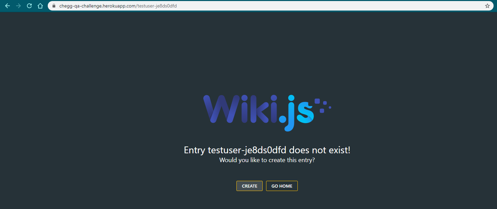

# CheggHerokuAppTests
This project does automated testing of various functionalities of [https://chegg-qa-challenge.herokuapp.com/testuser-je8ds0dfd](https://chegg-qa-challenge.herokuapp.com/testuser-je8ds0dfd)

## Test #1 (Auth)
1. When visiting the URL of your test page (provided separately) without logging in, the
user is redirected to https://chegg-qa-challenge.herokuapp.com/login - *Please refer to :* **loginURLRedirect()**
2. Entering an incorrect username/password combination should result in the message
“The email or password is invalid.” - *Please refer to :* **loginNegativeCredentialCheck()**
3. Entering the correct username/password you were given should successfully log you
into https://chegg-qa-challenge.herokuapp.com/ - *Please refer to :* **loginPositiveFlow()**
4. There should be no button to Edit the page on https://chegg-qachallenge.
herokuapp.com/ - *Please refer to :* **loginEditButtonNegativeflow()**

## Test #2 (Editing content)
Please note this section was leading to error page on the given URL.

**Steps to reproduce the error:**
1. Go the the given URL i.e. [https://chegg-qa-challenge.herokuapp.com/testuser-je8ds0dfd](https://chegg-qa-challenge.herokuapp.com/testuser-je8ds0dfd)
2. Login with provided credentils
3. URL changes to [https://chegg-qa-challenge.herokuapp.com/](https://chegg-qa-challenge.herokuapp.com/)
4. To reach to our intended page for editing content, again go back to [original URL](https://chegg-qa-challenge.herokuapp.com/testuser-je8ds0dfd) post-login
5. Observe an error page appears instead of editing content screen:

### Steps to execute this project
Pre-Requisite: Java Environment
1. Clone the Project to local IDE (Eclipse preferred - due to step 2)
2. After cloning, install TestNG plugin for that IDE (go to https://testng.org/doc/download.html section titled "Eclipse Plug-In")
Note: TestNG has compatible plugin for Eclipse to execute locally. Not sure to what extent it is supported in other IDEs
3. Once TestNG is installed, open a file named "testng.xml" in the main project directory
4. In that file, right click->Run as->TestNG Suite
5. Tests will be launched and execution details will be seen in the console
6. Once the test has completed execution, head towards test-output folder (might need to refresh project if this folder is not seen at first) and open index.html to explore HTML version of test execution report.
